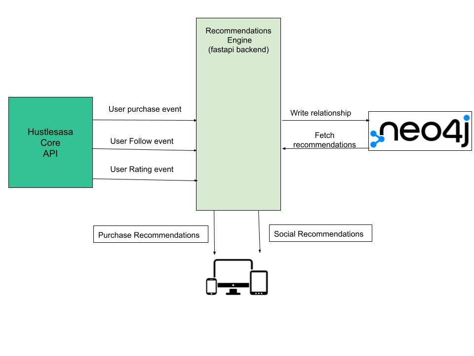
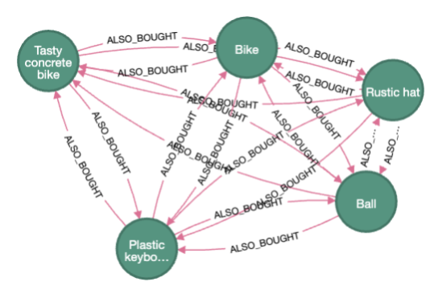
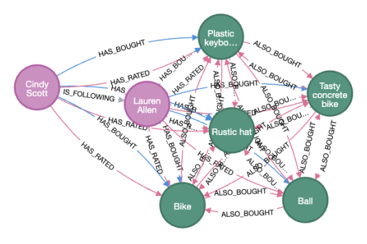

# Hustlesasa Recommendations

## Overview

Recommendation engine software for HustleSasa's e-commerce platform.

## Features

- **Fast and Asynchronous**: Built with Python's asyncio for high performance.
- **Built-in Validation**: Request and response validation out of the box using Pydantic.
- **Scalable**: Designed for both small and large-scale applications.

## Prerequisites

- **Python**: Make sure you have Python 3.7 or higher installed.
- **Pip**: Ensure `pip` is installed for dependency management.
- **Docker**: Ensure `docker` and `docker compose` is installed for container management.
- Optional: `virtualenv` for isolated environments.

## Installation

1. Clone the repository:
   ```bash
   git clone https://github.com/dakbill/hustlesasa-recommendations.git
   cd /path/to/hustlesasa-recommendations

2. Create a virtual environment:
    ```
    python -m venv venv
    source venv/bin/activate  # On Windows: venv\Scripts\activate

3. Install dependencies:
    ```
    pip install -r requirements.txt

4. Run the application:
    ```
    docker compose up -d --force-recreate
    fastapi dev main.py

## Project Structure
    ```
    .
    ├── app
    ├── main.py                 # Entry point of the application
    ├── test_main.py            # Unit tests
    ├── models.py               # Pydantic models
    ├── graph_repository.py     # Neo4j graph interface
    ├── routing.py              # rest routes
    ├── setup.py                # startup and shutdown logic
    ├── events.py               # mocks core api signals (follow, purchase, rating)
    ├── requirements.txt        # Project dependencies
    ├── images                  # Project documentation images
    ├── README.md               # Project documentation
    └── .gitignore              # Files and directories to ignore in Git

## Usage

Once the application is running, navigate to the following URLs:


## Testing
    ```
    pytest


## Services Architecture


## Recommendation Types

1. Product Recommendations 

This type of recommendations is based on products that frequently included in the same cart as the product of reference, sorted by the weight determined by the frequency of purchase and average rating.



2. Social Recommendations 

This type of recommendations based on products that purchased by other buyers a user of reference follows, sorted by the weight determined by the frequency of purchase and average rating.




